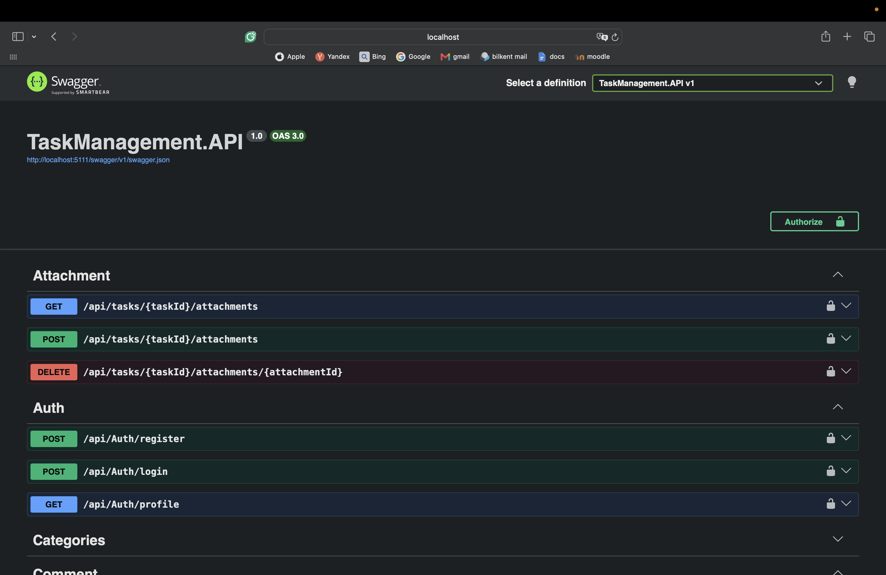
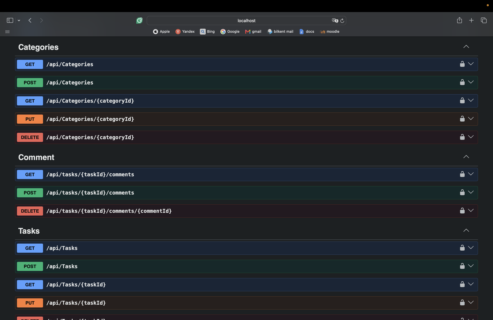
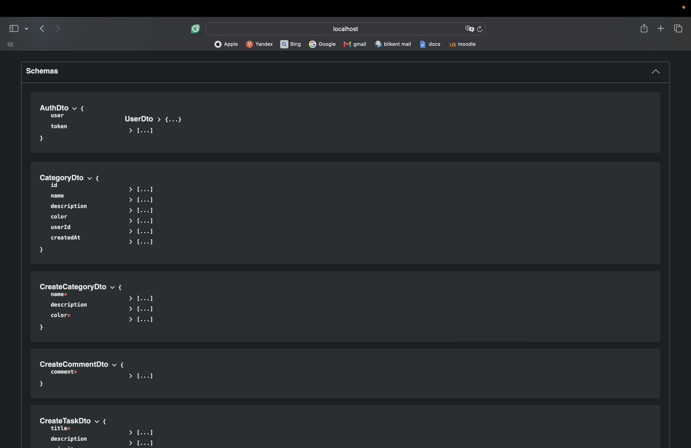
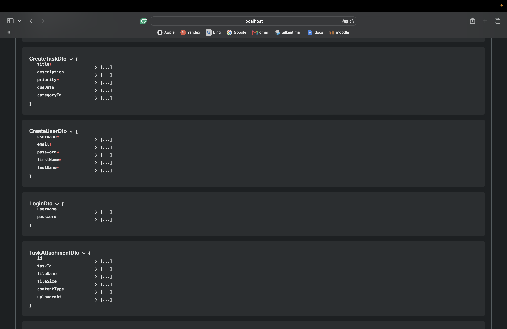
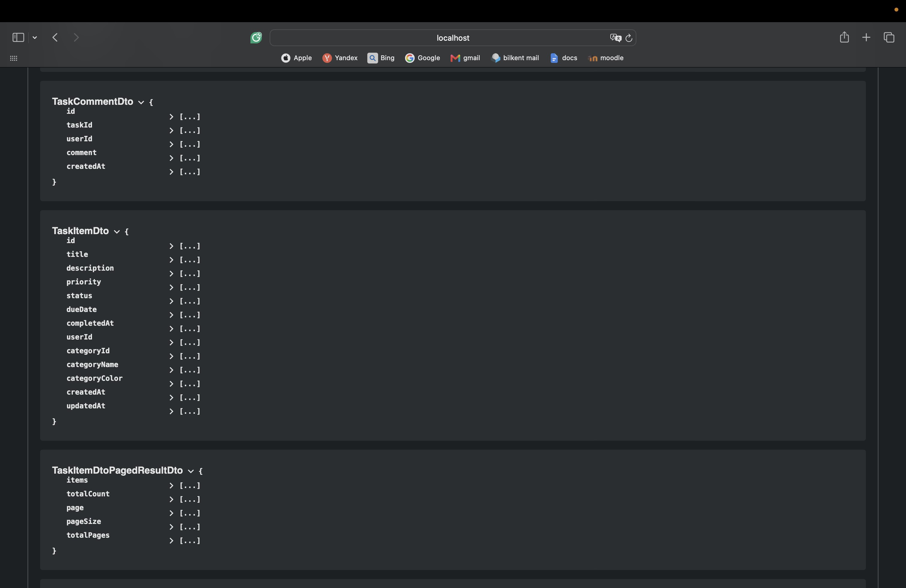
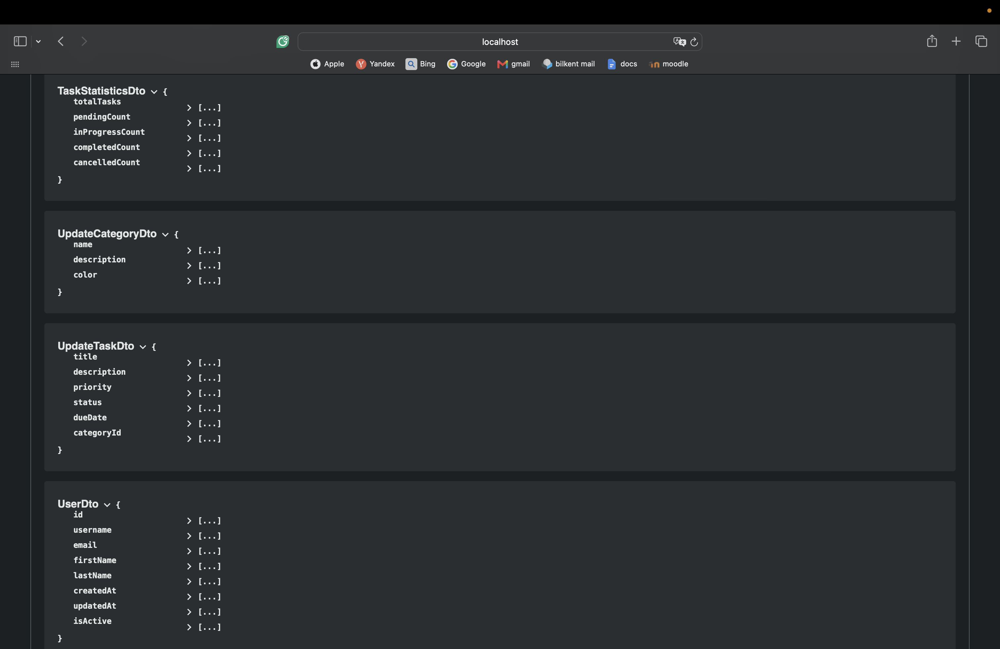

# API DOCUMENTATION

### Backend - Frontend Entegrasyonu

- CORS ayarları
- Authentication
  - Register
  - Logout
  - Route redirect
  - Profile
- Tasks
  - Task ekleme
  - Task düzenleme
  - Task silme
  - Task filtreleme
- Category
  - Category ekleme
  - Category düzenleme
  - Category silme
- Dashboard
  - Stats Card
  - Stats Chart
  - Recent Tasks
  - Overdue
  
 
  
   
 
## ROUTES

## SCHEMAS

